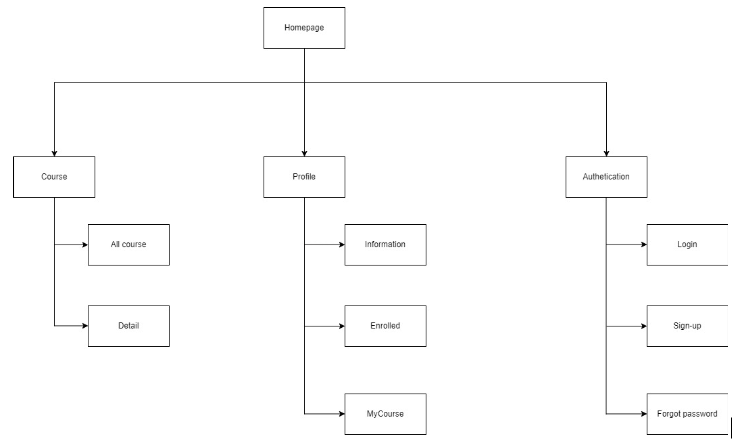
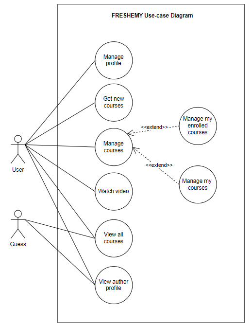
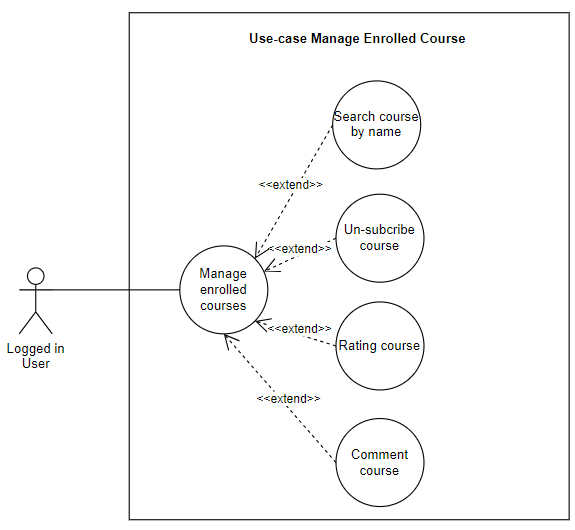
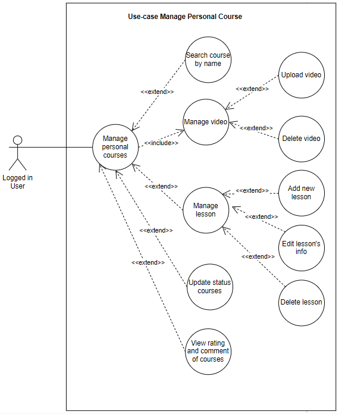

# Freshemy

# Requirement

## I/ Purpose

- Provide a website where anyone can share knowledge with each other by courses. Users can buy courses, create and uploads video for their courses

## II/ Functional Requirements

### User Registration and Authentication

- Allow users to register for a new account and log in to the system.

### Forgot Password

- Allows users to retrieve their password when forgotten. Users will be sent a password reset link via their email. The user will then be redirected to the password change page and change the new password

### Update profile

- Allow users to update their information (avatar, lastname, firstname,...) after logging in

### Create New Course

- User after login the ability to create another course and post it for other users to use

### Update Courses

- Users have the ability to update their courses (add/delete videos, update course status, edit course information, ...)

### Manage Enrolled Courses

- Users have the ability to view and unsubscribe from other author's courses that they have previously subscribed to

### Rating Course

- Users after logging in have the ability to rate other authors' courses when they have started learning (comments, rating stars...)

### Watch video

- Users after logging in can watch the videos in the registered courses. At the same time, you can watch the video you posted yourself.

## III/ Non-functional Requirements

### Performance

- The response time and display on the system when there is data input is less than 3s

- Time to upload video to the system up to 30s

### Security

- Accounts that are wrongly logged in up to 5 times, if they are wrong more than 5 times, they will be locked account

### Scalability

- The system can meet many people to visit at the same time and watch the same video content (200 users)

### Reliability

- System access failure rate is 2 times out of 1000 hits.

### Cross-platform Compatibility

- The application can run on many different browsers

## IV/ Target users

- Internal user: logged-in user

- External: Students and students from schools in Vietnam

## V/ Business Goals

### Tính dễ sử dụng

- Easy-to-use, easy-to-interact and user-friendly functions

- Users are allowed to search for new courses according to their interests by categories

- At the same time, users can upload their videos and share them with others

### Tính đa nền tảng

- Responsive application on different devices for a comfortable user experience

## VI/ Structure

## V/ Use-case diagram

## VI/ Functional MVP Requirement

### Manage Enrolled Courses

- Purpose: After logging in, users can manage registered courses
- Targeted user: Logged in user
- Description:
  - User selects Enrolled Course on navbar
  - Users type the course name to search on the search bar to search for the course by name
  - User selects a video that he wants to search
  - User chooses to unsubscribe from the course when clicking the unsubscribe button
  - Users choose Vote to rate and comment on the course
  - Users can view courses related to the author when clicking on the author's name in the video description
- Use-case:
  

### Manage Personal Courses

- Purpose: Người dùng sau khi đăng nhập có thể quản lý các khóa học do mình đã tạo
- Targeted user: Logged in user
- Description:
  - Người dùng chọn My Course trên thanh navbar
  - Người dùng gõ tên khóa học cần tìm trên thanh tìm kiếm để tìm kiếm khóa học theo tên
  - Người dùng chọn một video mà mình muốn tìm kiếm để vào trang quản lý các bài học của khóa đó
  - Người dùng nhấn vào nút "Create New" để tạo ra khóa học mới
  - Người dùng nhấn vào icon "Delete" để xóa khóa học tương ứng
  - Người dùng chọn icon "Edit" ở một khóa học bất kỳ để chỉnh sửa thông tin của khóa hoc (Add lesson, Edit lesson's info, Delete lesson, Update status course)
  - Người dùng cũng có thể xem bình luận và đánh giá về khóa học của mình khi bấm vào bất kỳ khóa học nào
  - Các khóa học được phân ra làm nhiều trang (tối đa 5 khóa học trên một trang)
- Structure:
  
